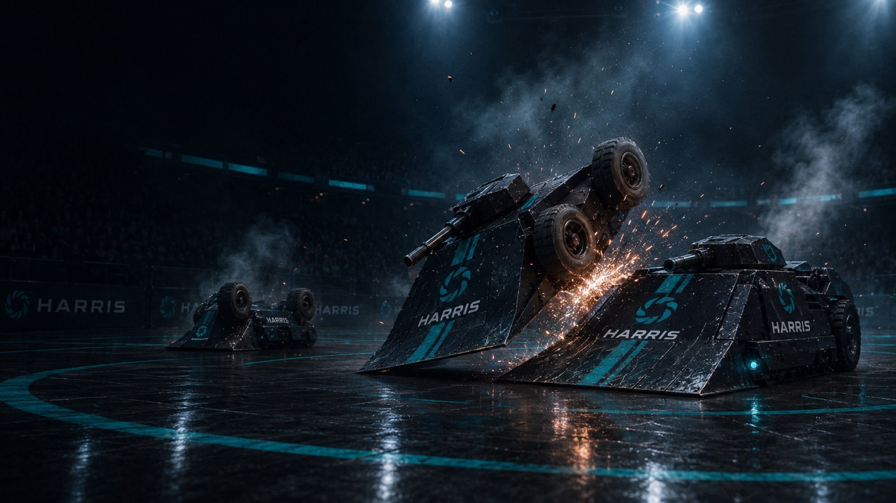

# Robot Wars: the AI build-off



Design a combat robot in one Python file, build its brain with Claude Code (or by hand), then watch it fight in a 3D broadcast arena on the big screen. Pure Python standard library. No installs, no dependencies, fully offline.

Built for the Harris all-hands in July 2026: 41 colleague-built bots fought a live free-for-all and 16 teams ran a knockout bracket. Public now so anyone can run their own.

## Why this exists

This is a Claude Code workshop wearing a robot costume. The loop players practice is the real skill: describe an idea in plain English, let the agent build it, test it, read what actually happened, refine. The game is deliberately full of trade-offs and chaos (shots miss, guns jam, robots get flipped wheels-up) so the winning move is never "max the stats". In playtesting, the biggest, tankiest build lost 7 out of 10 matches to a mid-size bot with a smarter plan. Thinking wins. That is the point.

## 60-second start

```
git clone https://github.com/ao92265/robot-wars-kit.git
cd robot-wars-kit
python3 arena.py        # Windows: py arena.py
```

That runs the starter robot against the practice dummies, animated right in your terminal. Any recent Python 3 works.

**Windows:** use Windows Terminal or the VS Code terminal (the old cmd.exe mangles the display). No Python at all? "Python 3.12" is free on the Microsoft Store and needs no admin rights.

## You only edit one file: `my_bot.py`

- `LOADOUT`, the machine: spend 12 points across `hp / speed / damage / range / special / agility`, plus three free archetype picks with real trade-offs: `size` (small / medium / large), `gun` (laser / cannon / shotgun), `engine` (standard / sprint / tank / hover)
- `APPEARANCE`, the paint: your colours and spinner shape on the big screen
- `decide(view)`, the brain: your strategy, called once per tick

Arsenal: your gun, rockets (travel + splash, can flip), mines (proximity, can flip), dash. Powerup crates on the big maps. Cover walls block shots. Shots can miss, guns can jam, blasts can flip you wheels-up and helpless. The real game: find the dirtiest legal strategy.

Quick reference: **`GUIDELINES.md`**. Every knob and trade-off table: **`CUSTOMIZE.md`**. Four contrasting builds to copy: **`examples/`**. Have Claude Code build it for you from one sentence: **`PROMPT.md`**.

## Test and tune

| Command | Does |
|---|---|
| `python3 arena.py` | starter vs all dummies, animated |
| `python3 arena.py --vs sniper` | fight one dummy (`duck`, `chaser`, `sniper`, `bomber`, `trapper`) |
| `python3 arena.py --vs sniper --best-of 20` | win-rate over N matches |
| `python3 arena.py --fast` | skip animation, just the result |
| `python3 arena.py --check` | is my loadout legal? |
| `python3 arena.py --replay match.jsonl` | replay a recorded match |
| `python3 arena.py --map colosseum` | bigger arena (`classic`, `arena`, `colosseum`, `gauntlet`, `pillars`) |

The bigger maps bite back: lava, water, ice, pits, powerup crates, a floor flipper that hurls robots wheels-up and a spinning turntable. Your bot sees every hazard in `view.arena.hazards`; dodging (or abusing) them is legal.

## Run a tournament

```
# 1. collect everyone's my_bot.py into submissions/ (or run the submit server):
python3 -m tournament.submit_server        # prints a URL players submit to over the LAN
# 2. validate and run the whole bracket, recording every match:
python3 -m tournament.runner submissions --auto --seed 1
# 3. big screen: open tournament/visual/tournament.html for the bracket,
#    or drop any recordings/*.jsonl on tournament/visual/arena.html
```

- Matches run headless in under a second each and every one records to `.jsonl`. Pre-run the whole tournament before your event; the recordings are the fallback if anything misbehaves live.
- Deterministic engine: same seed + same bots = byte-identical replay. All chaos rolls on seeded per-robot RNG, so results are fair and appealable.
- Every bot runs sandboxed in its own process. A crash or infinite loop idles that bot, never the show.
- Scales by entry count: 8 or fewer is one royale; more gets seeded heats with the top 2 advancing to a final.
- Balance tuning lives in `engine/config.py` (budget, stat curves, speeds, arena size).

## Run your own event

The 90-minute format that worked for 80 people:

1. **5 min** brief and rules, watch the demo match
2. **5 min** teams pick a loadout and write a three-line strategy on paper, design before code
3. **40 min** build `decide()` with Claude Code, test against dummies, iterate
4. **3 min** lock-in, bots collected
5. **15 min** knockout bracket live on the big screen
6. **5 min** awards and the debrief line: the winning team out-thought, not out-specced

Mixed teams work best. Non-engineers own the loadout and strategy calls (the archetype picks are plain-English decisions); engineers drive the code. Everyone has a job.

## Layout

```
my_bot.py            <- the only file players edit
arena.py             <- run / check / submit / replay
GUIDELINES.md        <- 2-minute cheat sheet
CUSTOMIZE.md         <- every knob: stats, guns, engines, mishaps, powerups
examples/            <- four contrasting builds to copy and tweak
PROMPT.md            <- paste into Claude Code
engine/              <- the game: sim, view, sandbox, render
tournament/          <- bracket runner, submit server, 3D visualiser
tests/               <- engine tests (python3 tests/test_engine.py)
```

Terminal animation needs nothing extra (ASCII). `pygame` is optional and only used by organisers.
